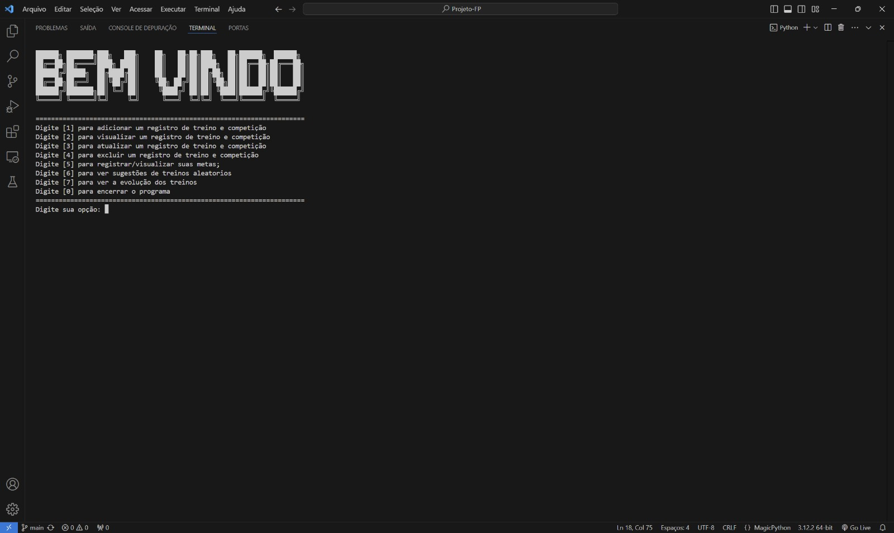
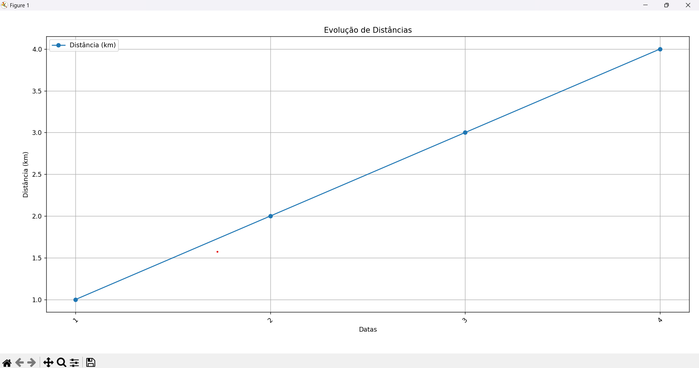
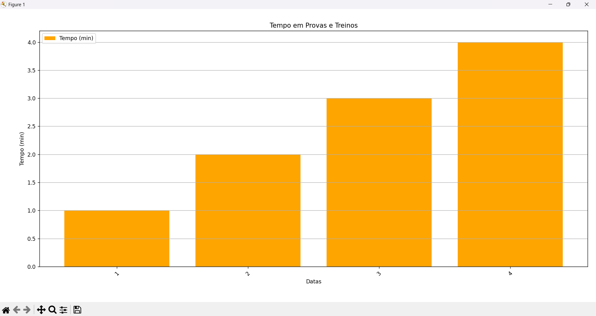
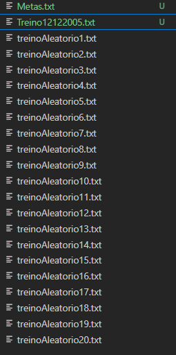

# PROJETO FUNDAMENTOS DE PROGRAMAÇÃO - CESAR SCHOOL
## CRUD DE TREINOS/COMPETIÇÃO

Nosso projeto tem as características do **CRUD**, que seria:

- **C**: CREATE (Criar)
- **R**: READ (Ler)
- **U**: UPDATE (Atualizar)
- **D**: DELETE (Excluir)

*O CRUD foi desenvolvido para atletas, em especial o nosso cliente Pedro é atletade corrida que deseja um acompanhamento sobre o seu rendimento. No CRUD, temos as funções mais básicas que são o de **Adicionar**, **Visualizar**, **Editar** ou **Apagar** os Treinos e/ou Competições, além de um sistema de **Metas** que tem somente as funções de **Adicionar** ou **Visualizar**. Assim como os treinos e competições, todos os dados são armazenados em um arquivo `.txt`, simulando um banco de dados. Junto ao CRUD, existe uma funcionalidade extra que mostra um gráfico com a evolução do usuário.*

*A interface inicial do CRUD é bem intuitiva. O usuário, ao iniciar o CRUD, se depara com uma interface bem explicativa que orienta o usuário sobre como interagir com o sistema:*

---

**Tela inicial do CRUD**

### Funcionalidades:

1. **Registrar Treinos e Competições**:
    O usuário pode adicionar registros de treinos e competições com informações como data, distância percorrida, tempo gasto, localização e condições climáticas.

2. **Visualizar Registros**:
   O usuário pode visualizar os treinos e competições registrados, com a opção de filtrar por distância ou tempo.

3. **Atualizar Registros**:
   É possível editar os registros de treinos ou competições, atualizando informações como data, distância, tempo, localizações e condições climáticas.

4. **Excluir Registros**:
   O sistema permite a exclusão de registros de treinos e competições, caso o usuário não precise mais dessas informações.

5. **Gerenciamento de Metas**:
   O usuário pode **adicionar** e **visualizar** metas relacionadas aos seus treinos, como alcançar distâncias ou tempos específicos.

6. **Treinos Aleatorios**:
   O Usuário terá a possibilidade de selecionar uma opção que pede ao sistema para sugerir treinos aléatorios já programados pelo desenvolvedores,  podendo assim ajudalo no desenvolvimento do seus treinos.
7. **Relatórios Visuais**:
   Uma funcionalidade extra do CRUD é a geração de gráficos que mostram a evolução do usuário em termos de distância percorrida e tempo. Isso ajuda o atleta a monitorar seu progresso ao longo do tempo.

---

### Como Funciona o Sistema?:

Os dados de treinos, competições e metas são armazenados em arquivos de texto (`.txt`), o que simula um banco de dados simples. Cada treino ou competição registrado é salvo com o nome no formato `TreinoDDMMYYYY.txt`, enquanto as metas são armazenadas no arquivo `Metas.txt`.
A interface do programa é bem simples e fácil de usar, guiando o usuário por menus e opções claras. Ao iniciar o sistema, o usuário pode escolher facilmente o que deseja fazer, seja adicionar um novo treino, visualizar um treino anterior, atualizar dados ou excluir registros, existe também a possibilidade de escolher a opção de Treinos Aleatorios, onde irá aparecer todos os possiveis treinos, para que o nosso cliente se sinta da melhor forma para decidir qual ele irá escolher.Criamos como funcionalidade extra um gráfico que demonstra seu desenvolvimento pessoal nas corridas onde nosso cliente poderá analisar se teve uma evolução ou uma perda.

**Exemplo do gráfico 1:**

**Exemplo de como fica o gráfico 2:**

**Exemplo de como fica os arquivos.txt na Pasta: **

---

### Conclusão:

Pretendemos garantir uma forma inovadora e mais intuitiva ao usuário, que por meio de um gráfico consiga ver o seu rendimento consequentemente melhorando a sua saúde e o seu bem estar. 

---

### INTEGRANTES: 

| Nomes           | Turma | E-mail institucional |
| --------------- | ----- | -------------------- |
| Andre Avelino   | A     | aafo@cesar.school    |
| Arthur Monteiro | A     | aml@cesar.school     |
| Caio Mathews    | A     | cmff@cesar.school    |
| Gabriel Miranda | A     | gmml@cesar.school    |
| Thiago Medeiros | A     | tfm3@cesar.school    |